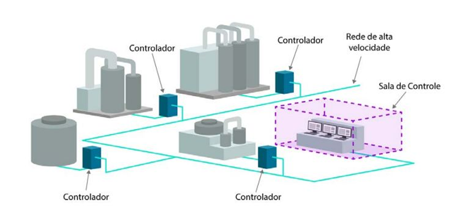

# Notas de Aula — Aula 04

**Docente:** Prof. Me. Deivison S. Takatu  
**Data:** 20/03/2026  
**Tema:** Sistemas Digitais de Controle Distribuído (SDCD)

---

## Registro da Aula

A quarta aula tratou dos Sistemas Digitais de Controle Distribuído (SDCD), contextualizando seu surgimento como resposta às limitações dos modelos centralizados de controle que predominaram nas primeiras décadas da automação industrial. A discussão percorreu os fundamentos conceituais do SDCD, seus componentes, suas vantagens operacionais e um estudo de caso que ilustrou a aplicação desse paradigma em uma empresa de processos críticos.

## Tópicos Trabalhados

- Limitações históricas do controle centralizado e motivação para o modelo distribuído
- Conceituação e estrutura do SDCD
- Componentes do sistema: sensores, atuadores, controladores distribuídos, rede industrial e sistema de supervisão
- Vantagens do modelo distribuído: confiabilidade, redundância, escalabilidade e disponibilidade
- Diferenças entre CLP e SDCD
- Estudo de caso: TSMC

## Sistema Digital de Controle Distribuído (SDCD)

O SDCD surgiu como resposta direta às fragilidades do controle centralizado, no qual um único equipamento concentrava todo o processamento da planta. Nesse modelo, a falha do controlador central comprometia a operação completa — risco inaceitável em processos industriais contínuos ou de alta criticidade. A solução foi distribuir o processamento entre múltiplos controladores posicionados fisicamente próximos aos equipamentos que monitoram, de modo que cada um seja responsável por uma etapa ou seção específica do processo.

A comunicação entre os controladores ocorre por meio de redes industriais dedicadas. Uma estação de supervisão centraliza a visualização dos dados e o acompanhamento do processo como um todo, mas não concentra o controle — essa distinção é central para compreender o modelo.

## Vantagens do Modelo Distribuído

- **Eliminação do ponto único de falha:** a queda de um controlador afeta apenas o trecho sob sua responsabilidade; os demais continuam operando normalmente.
- **Redundância:** sistemas SDCD tipicamente preveem mecanismos de redundância que permitem a outro controlador assumir o controle em caso de falha.
- **Alta disponibilidade:** o sistema pode permanecer em operação durante manutenções ou substituições de componentes.
- **Escalabilidade:** novos pontos de controle podem ser adicionados sem reconfiguração estrutural do sistema existente.
- **Redução de cabeamento:** controladores posicionados próximos aos equipamentos eliminam extensos percursos de cabos entre o campo e uma sala de controle centralizada.

## CLP versus SDCD

| Característica | CLP | SDCD |
|---|---|---|
| Aplicação principal | Controle de máquinas e processos discretos | Controle de processos contínuos e complexos |
| Estrutura | Mais compacta e modular | Altamente distribuída |
| Volume de variáveis | Menor | Muito elevado |
| Ambientes típicos | Linhas de montagem, células robotizadas | Refinarias, usinas, plantas químicas |

## Estudo de Caso — TSMC

A TSMC (Taiwan Semiconductor Manufacturing Company) opera plantas de fabricação de semicondutores cujos processos não admitem interrupções. Qualquer parada não programada resulta em perdas irreversíveis de material e tempo de produção de alto valor agregado. A empresa utiliza arquitetura distribuída para garantir continuidade operacional: mesmo durante manutenções programadas ou falhas isoladas de componentes, a planta mantém suas operações de forma ininterrupta, com os controladores redundantes assumindo automaticamente o controle das seções afetadas.
